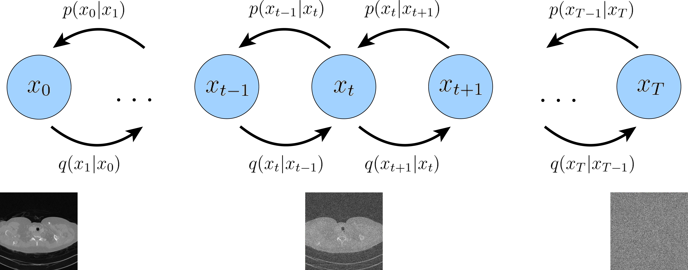

# [RECOMB'26] PC-POCS Sampler to reconstruct a sparse-view computer tomography image with both prior and measurements
A Predictor-Corrector based Projection Onto Convex Set Diffusion Sampler, used to reconstruct a sparse-view computer tomography image.

## Requirements
1. Clone this repository
'''git clone https://github.com/yuanbingyan/PCPOCSSampler.git'''

2. Install Package: Create Conda environment
'''
conda env create -f environment.yml
conda activate sip_torch
'''
